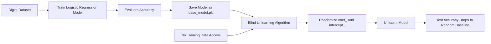
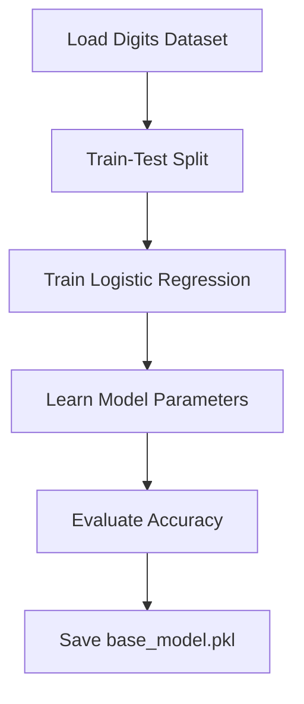
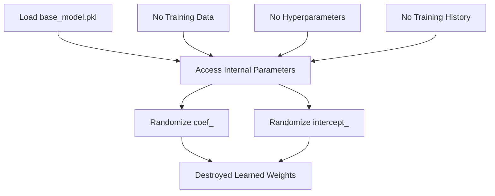
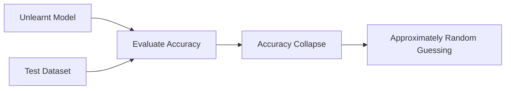
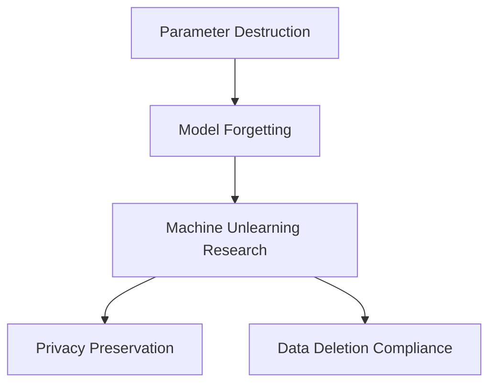

# Day 8 :Absolute Machine Unlearning: Weight Shattering in a Logistic Regression Model

This project demonstrates a minimal implementation of **absolute machine unlearning** using a Logistic Regression classifier trained on the handwritten digits dataset. An independent algorithm loads a previously trained model and destroys its learned knowledge by directly randomizing its internal parameters, without requiring access to the original training data or training process.

---

## System Workflow
 


---

## Phase 1: Base Model Training



### Action

The handwritten digits dataset is loaded and divided into training and testing sets. A Logistic Regression classifier is trained using the training data.

### Result

The model learns meaningful patterns by optimizing its internal parameters (`coef_` and `intercept_`) to classify handwritten digits accurately. The trained model is serialized and saved as `base_model.pkl`.

---

## Phase 2: Blind Unlearning



### Action

The unlearning function loads the saved model without any knowledge of how the model was originally trained.

### Mechanism

If the model contains learnable parameters (`coef_` and `intercept_`), they are replaced with Gaussian random noise generated using:

```python
np.random.normal(0, 1, shape)
```

This process destroys the statistical relationships learned during training.

---

## Phase 3: Verification



### Result

The modified model is evaluated using the original test set. Since the learned parameters have been completely randomized, the model loses its ability to recognize digit patterns.

* Original accuracy: High classification performance.
* Post-unlearning accuracy: Near random baseline.
* Expected random accuracy for 10 classes: Approximately **10%**.

---

## Why This Matters



This implementation demonstrates a simple form of machine unlearning by directly destroying learned parameters. Although real-world machine unlearning often focuses on removing specific training samples rather than erasing the entire model, this approach illustrates how learned knowledge is stored within model parameters and how manipulating those parameters can eliminate previously acquired information.
