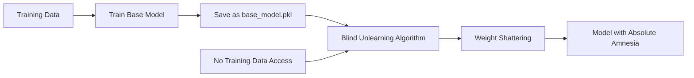
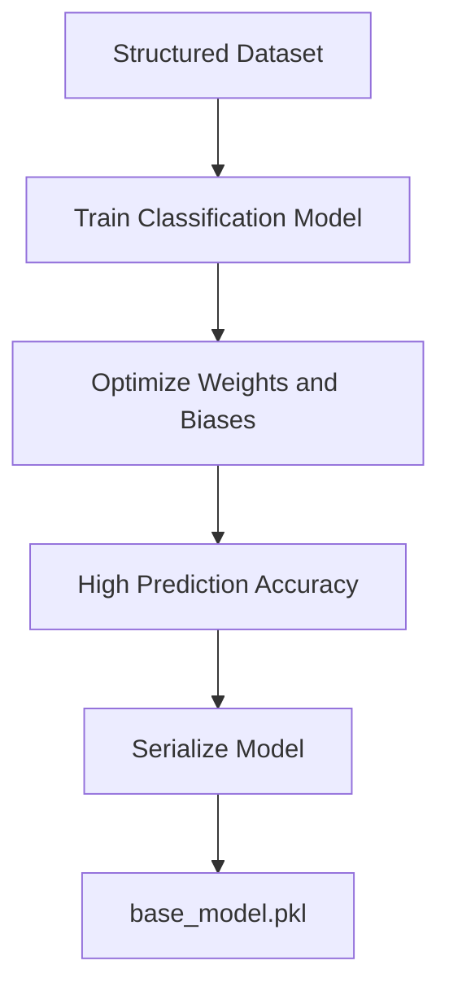
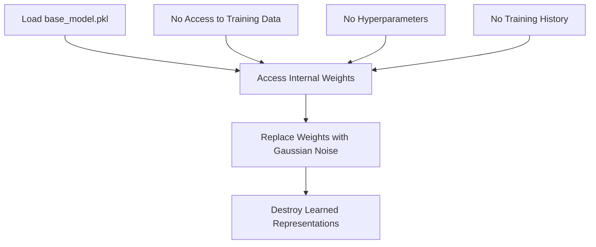
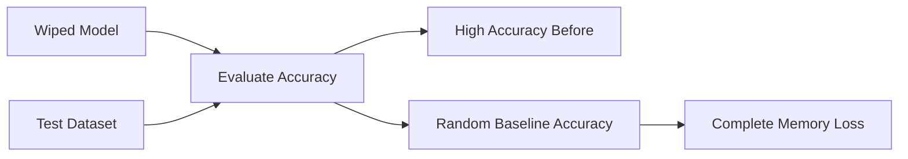
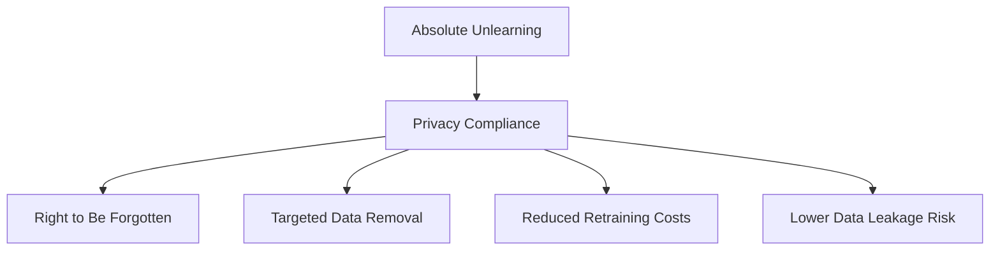

# Absolute Machine Unlearning: A Minimalistic Implementation

This project demonstrates a minimal implementation of **absolute machine unlearning**, showing how an independent algorithm can load a pre-trained machine learning model and erase its learned knowledge without access to the original training data or training process.

## Workflow

## Phase 1: Knowledge Acquisition

**Action:** A standard classification model is trained on a structured dataset.

**Result:** The model learns internal representations by optimizing its parameters. The trained model is serialized and saved as a `.pkl` file.

---

## Phase 2: Blind Unlearning

**Action:** An independent script loads the model without any knowledge of its original training process.

**Mechanism:** The algorithm directly overwrites the model's internal parameters (`coef_` and `intercept_`) with Gaussian random noise.

---

## Phase 3: Verification

**Result:** Model performance collapses from a high accuracy level to near-random chance (e.g., ~10% for a 10-class classification task), indicating complete knowledge removal.

---

## Why This Matters

Although this project demonstrates complete memory erasure, the underlying principles align with modern AI privacy requirements. Similar approaches motivate machine unlearning systems designed to remove specific user information while avoiding expensive full-model retraining.
